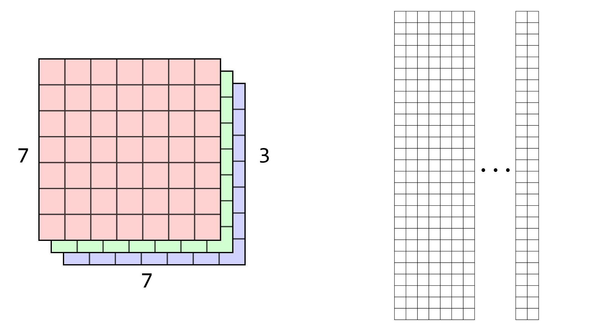

# CSE 490g1 / 599g1 Homework 1 #

Welcome friends,

For the second assignment we'll be implementing two core building blocks to deep learning, convolutional layers and maxpooling layers.

## 5. Convolutions ##

In this homework we will implement convolutional layers using the `im2col` method. This technique is not optimal for every situation but it is a simple way to get very efficient convolutions both on CPU and GPU. One downside is that it can only process images one at a time, so we don't get any extra benefit from batch processing. That's fine though. Open up `convolutional_layer.c` and let's get started!

### 5.1 `im2col` ###

As we discussed in lecture, most of our convolution code will be handeled our `im2col` funciton. Check out `forward_convolutional_layer` to see how our layer will be processed using this function. The basic idea is our filters are already stored appropriately in the `l.w` matrix. We simply need to lay out our image correctly so that doing a matrix multiplication results in running the filters over the image.

First, let's start with some assumptions. We assume that we will always use padding for our convolutions, thus a convolutional layer with a stride of 1 will always return a feature map with the same spatial dimensions as the original. For strided convolutions, if the feature map is a multiple of the stride we simply return a feature map that is downsampled by a factor of the stride. If the input size is not divisible by the stride, we err on the side of making the output slightly larger, not smaller.

For example, if we have an input feature map of spatial dimension `7x7`, and a convolutional layer with stride 2 the output will have spatial dimension `4x4`. This is a specific design decision and you could decide other ways to do this, or implement functionality that allows you to control the padding and input/output sizes. However, for this homework, we'll stick to these choices because they make good default behavior.

Your job is to fill in the column matrix with the appropriate values. There are several ways to go about doing this. The most efficient is probably to loop over the matrix elements in order (first the first row with each column sequentially, then the second row, etc), find the appropriate index in the original image, and copy that value over to the column matrix. This gif may help?

This is an example of `im2col` on a `7x7x3` image with filter size of 3 and a stride of 1. Note, the letters aren't meant to convey that the values are the same in each channel of the image, just to help you understand which positional elements map to where in the output.

### 5.2 `col2im` ###

This is going to be very similar to `im2col` but backwards. Also, instead of setting values directly, we will be adding values from the column matrix back into the image. Multiple values from the column matrix will map to the same element in the image so we want to make sure all of them contribute.

### 5.3 `update_convolutional_layer` ###

Now you have to update your convolutional layer! This will be very similar to the update method you wrote for the connected layer. Maybe even exactly the same?

## 6. Maxpooling ##

Maxpooling is another core building block of convolutional neural networks. Implementing maxpooling will be similar to implementing convolutions in some ways, you will have to iterate over the image, process a window of pixels with some fixed size, and in this case find the maximum value to put into the output.

### 6.1 `forward_maxpool_layer` ###

Write the forward method to find the maximum value in a given window size, moving by some strided amount between applications. Note: maxpooling happens on each channel independently.

### 6.2 `backward_maxpool_layer` ###

The backward method will be similar to forward. Even though the window size may be large, only one element contributed to the error in the prediction so we only backpropagate our deltas to a single element in the input per window. Thus, you'll iterate through again and find the maximum value and then backpropagate error to the appropriate element in `prev_delta` corresponding to the position of the maximum element.

## Experiments With Convnets! ##

There is an example of a convnet architecture in `tryhw1.py`. Try it out and try a few of your own!

Now, for the unmodified convnet architecture in `tryhw1.py`, calculate how many operations it takes to process one forward pass through the network. You only need to worry about the matrix operations since everything else is pretty small compared to them.

Let's assume that we have fused multiply-adds so a matrix multiplication of a `M x K` matrix with a `K x N` matrix takes `M*K*N` operations. How many operations does the convnet use during a forward pass?

Design a fully-connected network that uses the same number of operations and has the same number of layers. Now train this network on CIFAR. What are the comparative accuracies of the two networks? Do convolutions work better than fully-connected layers? Why do you think in this case you see the results you do, what indicators do you have? Put your network configuration and answers to these questions in `tryhw1.py`.

## PyTorch Section ##

Upload `hw1.ipynb` to Colab and train some big convolutional networks on real image datasets, like ImageNet! Once you are done with this section make sure you re-download your Python notebook so you can turn it in!

## Turn it in ##

First run the `collate_hw1.sh` script by running:

    bash collate_hw1.sh
    
This will create the file `hw1.tar.gz` in your directory with all the code you need to submit. The command will check to see that your files have changed relative to the version stored in the `git` repository. If it hasn't changed, figure out why, maybe you need to download your ipynb from google?

Submit `hw1.tar.gz` in the file upload field for Homework 1 on Canvas.

